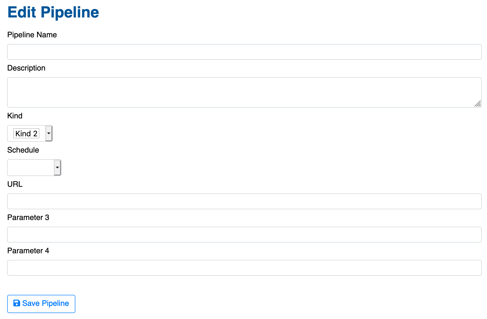

# Configurable Airflow UI

This library provides a wrapper around airflow, providing a means to add / remove DAGs (Pipelines) via a web-ui based on a configuration defining the Pipeline 'kinds' and the parameters each kind requires.

### Pipeline Dashboard


### Edit/New Pipeline


### Pipeline Status


## Quickstart

1. Create a folder containing:

- A `configuration.yaml` file with the details on your pipeline kinds, e.g. 

```json
{
    "kinds": [
        {
            "name": "kind1",
            "display": "Kind 1",
            "fields": [
                {
                    "name": "param1",
                    "display": "Parameter 1"
                },
                {
                    "name": "param2",
                    "display": "Parameter 2"
                }
            ]
        },
        {
            "name": "kind2",
            "display": "Kind 2",
            "fields": [
                {
                    "name": "param3",
                    "display": "Parameter 3"
                },
                {
                    "name": "param4",
                    "display": "Parameter 4"
                }
            ]
        }
    ]
}
```

- The Airflow DAGs Creator - a Python file that reads the pipeline configuration and creates your Airflow DAGs.
  Sample code:

```python
import datetime
import logging
from airflow import DAG
from airflow.operators.bash_operator import BashOperator
from airflow.utils import dates
from etl_server.models import Models

etl_models = Models()

default_args = {
    'owner': 'Airflow',
    'depends_on_past': False,
    'start_date': dates.days_ago(1),
}

for pipeline in etl_models.all_pipelines():
  # pipeline looks like this:
  # {
  #   "id": "<identifier>",
  #   "name": "<English Name of Pipeline>",
  #   "kind": "<kind-name>",
  #   "schedule": "<schedule>",
  #   "params": {
  #      "field1": "value1",
  #      .. other fields, based on kind's fields in configuration
  #   }
  # }
    dag_id = pipeline['id']
    logging.info('Initializing DAG %s', dag_id)
    dag = DAG(dag_id, default_args=default_args, schedule_interval=datetime.timedelta(days=1))
    task = BashOperator(task_id=dag_id,
                        bash_command='echo "%s"; sleep 10 ; echo done' % pipeline['name'],
                        dag=dag)
    globals()[dag_id] = dag

```

2. Use a `docker-compose` setup to run the server, an example `docker-compose.yaml` file:

```yaml
version: "3"

services:

  db:
    image: postgres:12
    environment:
      POSTGRES_PASSWORD: postgres
      POSTGRES_USER: postgres
      POSTGRES_DB: etls
    expose:
      - 5432
    volumes: 
      - /var/lib/postgresql/data

  server:
    build: .
    image: akariv/airflow-config-ui
    environment:
      DATABASE_URL: postgresql://postgres:postgres@db/etls
      AIRFLOW__CORE__SQL_ALCHEMY_CONN: postgresql://postgres:postgres@db/etls
    expose:
      - 5000
    ports:
      - 5000:5000
    depends_on: 
      - db
    volumes: 
      - /path/to/local/dags/folder/:/app/dags
```

After running (`docker-compose up -d server`), open your browser at `http://localhost:5000` to see the web UI.

Another option is to create a new Docker image which inherits from `akariv/airflow-config-ui` and replaces the contents of `/app/dags/` with the `configuration.json` file and your DAG Python files.